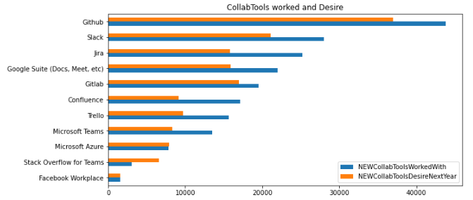

#　What technology is crazy about developers around the world?

Stack Overflow, which runs the developer community, announced the annual developer survey "2020 Developer Survey" on May 27th.
Stack Overflow offers a community site for developers, with over 50 million unique visitors. The Developer Survey is the company's annual survey, and this is the 10th time this year.The survey was conducted in February 2020, with approximately 65,000 developers responding on a global basis.

Let's Check out the perspectives of developers around the world

Question  
  1. What technology is crazy about developers around the world? What do you expect next? 
    1.1 What is most popular Language ?  
    1.2 What is most popular platform ?  
    1.3 What is most popular Database ?  
    1.4 What is most popular collaboration tool ?  
    1.5 What is most popular  web framework ?  
    1.6 Other technologies？  
  2. What are the factors related to salary?  

# 1. What technology is crazy about developers around the world? What do you expect next?

Underpinning today's digital society are undoubtedly the members of the developers who participate here.
What technology are they using?  
Also, now that technological innovation is required, what kind of technology are you focusing on next?

## What is most popular Language ?
Python is still very popular. The library is abundant, fresh, and there is a lot of information, so I feel like I can do anything.　　
However, it seems that Rust, which I often hear recently, is good. Let's try it next time. 　
There are many languages I don't know. I haven't studied enough.

## What is most popular platform ?
The cloud has become widespread and Linux has become the standard.  
Will Windows, which has been supporting our business for a long time, be chased?
Starting with Docker, which grew up on Linux, expectations for Kubernetes are high.  
It's the tide of new technology.  
There are many AWS users, but there are high expectations for Google Cloud, which is strong in AI.  
(This Notebook is also working on Google Cloud)  

## What is most popular Database ?
I'm not familiar with Databese. I know that MySQL and PostgreSQL are major. 
I recently learned about the power of the Columner database.  
This is Yandex's ClickHouse (https://clickhouse.tech/). 

Very lightweight and fast. It is indispensable for handling big data.
There are various databases, each of which has its advantages and disadvantages. It's difficult to decide which database to choose.
The columnar database Cassandra is also fast, isn't it?
there are many technologies that Database does not know. let's study...

## What is most popular collaboration tool ?
Stack Overflow is growing fast. (Because it's a Stack Overflow survey)  
Github is no longer common sense.It may be the platform most frequently used by developers.

## What is most popular  web framework ?
I'm not a web developer, so I'm not sure.   
This course (Udacity) deals with Flask, but there seems to be a technology that is drawing more attention.

## Other technologies？
 TensorFlow is not popular as an AI framework, but I personally like Pytorch.  
 Is Hadoop old when it comes to distributed infrastructure? Isn't Spark better?   
 There are many technologies that I do not know. let's study..

#2. What are the factors related to salary?
What is the income of developers around the world?
You can't be a developer just because you like technology. You also need money, right?

It's a bit old, but I'll use the information from the 2017 survey. Let's explore the factors related to the salary of developers around the world.

First, build a prediction model with the objective variable as a "salary".  
Next, we will use SHAP, an explainable AI, to see which variables contribute to the prediction and how much.

1. Creating variables  
  Remove the "salary" and the highly correlated  'Respondent' and 'ExpectedSalary' from the data.
  Delete the rows that have missing values in the "salary".  
  Categorical variables are converted to dummy variables and the data is arranged.
  now, we have 12891 rows × 1103 columns for candidate variable

2. Creating a regression model
The estimator uses LightGBM.
Parameter tuning uses the library "Optuna", which efficiently searches for parameters by Bayesian inference.
Actually, we use "LightGBMTuner", a package that automates parameter search based on Optuna based on the characteristics of lightGBM parameters.  

3. Divide the data into 7: 3 and use them for training and testing, respectively.  

4. result
Plot the correlation between prediction and reality. You can see a certain correlation.

5. find factors related to salary
Next, we will identify the factors that influence Shap, which is one of the explainable AIs using game theory.
Red represents the impact on the prediction value when the variable is high (plus or minus is represented by the plot on the horizontal axis. Blue represents the impact on the prediction (plus or minus) when the variable is low. ..

- In the United States, the forecast value is quite positive, and the range is wide (it shows that the range of salary is also large).
  This is influenced by the high-priced areas of Silicon Valley.
- In addition, a wealth of engineers over 20 years have contributed to the positive forecast.  
  On the contrary, it can be seen that the predicted value is swinging negative for young engineers who have little experience for 1 to 3 years.
- In addition, European engineers and engineers with a master degree have a positive forecast.
- In addition, being a venture company is also a positive forecast value.  

It is also possible to provide information similar to Tree-based Featue Impottance.
With this information, you can see the degree of impact, but you can not confirm how much each variable will have a positive effect or a negative effect, which is the advantage of SHAP.

#3. Conclusion

I searched for developers from the Stack overflow survey in 2020 and 2107.
Did you find any points that were in line with your intentions? Knowing what technologies active developers are using and what they are paying attention to in the future is useful information for those who will acquire the technology.
Working in Silicon Valley shouldn't be all about engineer happiness.

Let's learn the technology!

