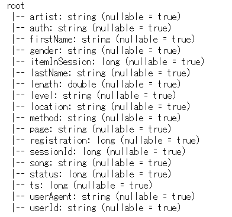
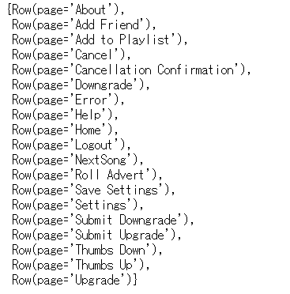
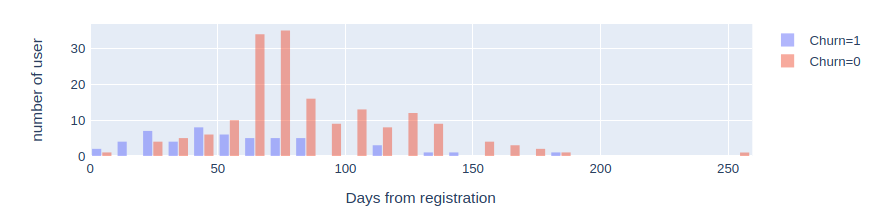
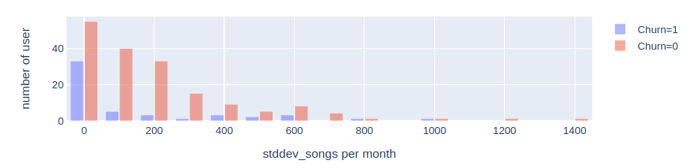
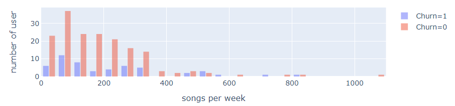
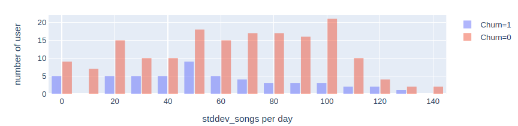
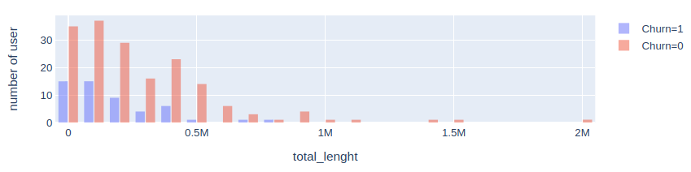
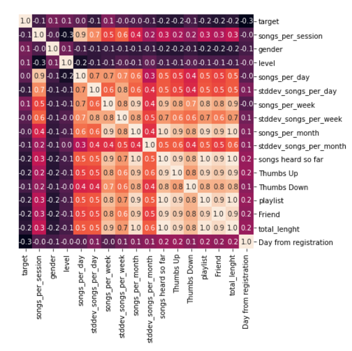
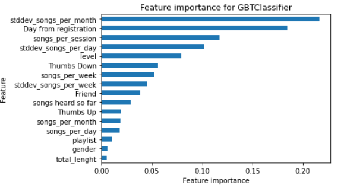
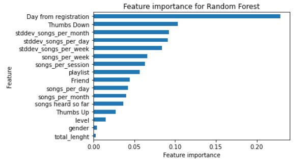

# To be the best music service for you

The music distribution service, which pioneered subscription services, has become a part of our lives and has changed the way we enjoy music.
Since various providers compete, you can easily use one-click joining and leaving, free trial, service promotion, etc.,
Users can choose the service that suits their taste and style.
Gaining market share is very important because the main sources of income for music distribution are advertising revenue and user fees. 
The lifeline of the service is to grasp the user's satisfaction and trends, and to maintain and acquire users through first-class services.
They are aiming to provide music tailored to each customer, and is trying to differentiate itself from others.

In these subscription services, operation logs are a powerful tool for grasping the market.

# General

In this project, from the user operation log of music distribution service SPOTIFY build a classification model that identifies users who are likely to opt out without being satisfied with the service.

# Software Requirements
- Python3
- Pyspark 2.4.3
- Plotly 2.0.15

# Data
Sparkify user operation log From October 1, 2018 to early December
- file name:"mini_sparkify_event_data.json"  

The data is a time-series log that records user operations for two months.
In real business, we need to handle a larger amount of data, so we will adopt Pyspark, a scalable analysis platform.
Note:The data contains personal information and can only be accessed by Udacity teachers and students.

# Steps
## Data column

Data have following columns   

column"page" show fotprint.  

## Define Churn(Define Objective variable)

The objective variable on the classification model is defined as the history of access 
to the "Cancellation Confirmation" page, which is the operation for identifying the canceled user in the operation log.

## Explore Data    

From the original log, we will derive and confirm the variables that are considered to have a high correlation with the churn user.
I paid attention to the following.

-Ratio of cancellations by men and women

-Rate of cancellation with paid members and free members

-Average of song plays per session

-Average of song plays per day

-Average of song plays per week

-Average of song plays per month

-Standard deviation of songs play per day

-Standard deviation of songs play per week

-Standard deviation of songs play per month

-Total length to play the song so far

-Number of likes and dislike

-Number of songs added to playlist

-Number of friends

-days from registration

**Some examples**  

Logs are time-series data that record each operation by individual users. 
Now, We will convert into characteristic data for each user.

### Correlation coefficient
After the variables are identified, check the correlation between the objective variable and each variable and find a valid variable.
You can see the correlation coefficient of each variable with Target.
And you can also see some variables that are highly correlated.

### Metric Definition
This is unbalanced data.There are only a small percentage of churners, so if you predict not to churn all, Recall will get a good score.
Precision and Recall are not suitable for evaluating the model.Uses F1-Scoore.

### Model selection
Check the following three methods supported by PysparkML.

#### Logistic Regression
when the objective variable and the design variable have a linear relationship, it is an excellent method in terms of calculation cost and model readability. Check as a base model. On the other hand, it should be noted that the prediction accuracy deteriorates due to Multicol linearity when the variables are highly correlated.

#### Random Forest/ GBT
Assuming the nonlinearity of the objective variable and the design variable, select a tree-based random forest boosting method that can support some readability.
This method can also be expected to be sparse so that the classifier can extract valid variables.

### Model improvement

**Model tune**  
A grid-based search for maxDepth, maxBins, and maxIter parameters for a Tree-based model. The parameter with the best score was adopted.

**robustness**  
After the train and test data were divided into 7:3, the train data was cross-validated five times and then the average score was adopted. This is an effective means for improving robustness when the amount of data is relatively small.

### Result

We conducted three models and obtained the following results. 
When conducting a campaign to Churn users, we would like to reduce the number of detections that Churn misses, while over-detection will distribute useless campaigns. The campaign can be conducted efficiently by referring to the F1 Score, which is the harmonic average of Recall and Precision.

|model               | f1 score | accuracy | recall  | Precision |
|--------------------|----------|----------|---------|-----------|
|Logistic Regression | 0.85     | 0.85     | 0.84    | 0.85      |
|GBTClassifier       | 0.87     | 0.87     | 0.86    | 0.87      |
|Random forest       | 0.75     | 0.81     | 0.76    | 0.81      |

## Future considerations

Featue Impottance for a tree-based model.
You can see that the following are variables that contributed to the classification accuracy.

- Standard deviation of songs play per month
- days from registration
- song per session

**GBT**  

**Random Forest**  

# Conlcusion

The Logistic regression model score is not bad . However, the correlation between variables is high, and there is concern that it may become unstable due to Multicol linearity. Coefficients cannot be well interpreted.

In this case, the Tree model has a more stable score and has better interpretability of future importance.
We were able to identify the features of the user who might cancel and extract useful features using the ensemble model.

We selected important Featurer, but in order to understand the actual market trends, it is necessary to use larger scale data, and we can imagine that the prediction accuracy and features may change. A large-scale distributed infrastructure is indispensable for developing services based on vast amounts of customer data.

In the implementation, machine learning can be implemented in the same procedure as Sklearn, so it was found to be a powerful candidate tool for handling large-scale data.
On the other hand, the widespread use of powerful column-oriented databases suitable for large-scale data has increased the choices when dealing with large-scale data. It is necessary to understand the merits and demerits of various methods and select the appropriate method.

*Column-oriented databse*  
ClickHouse  Fast!  
https://clickhouse.tech/
